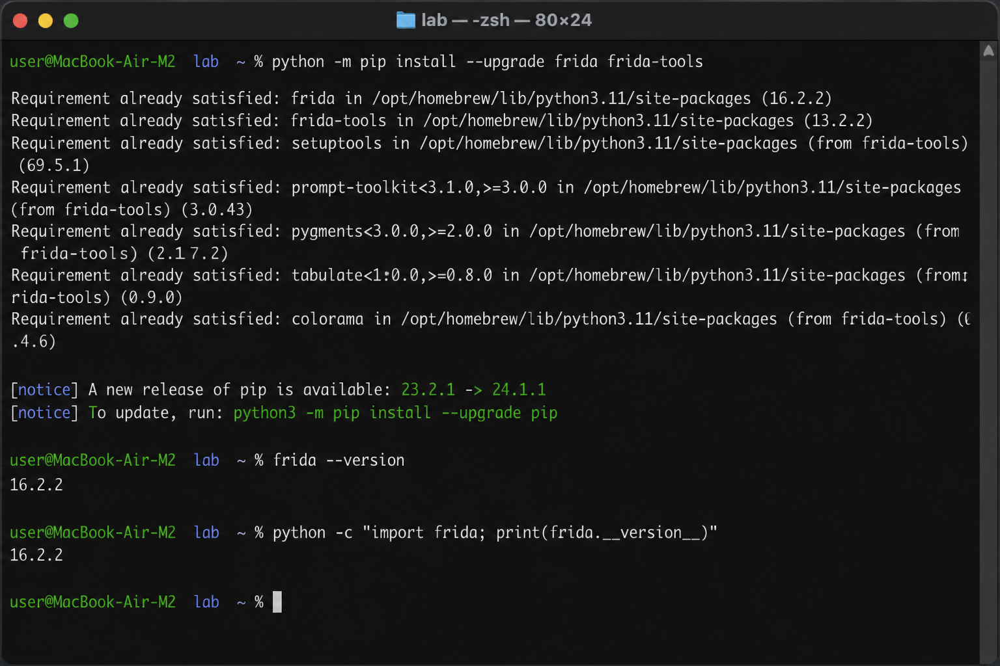
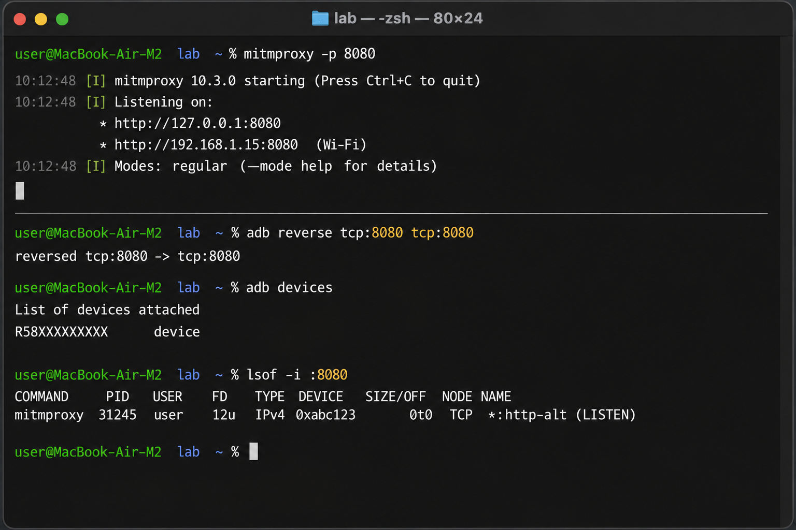
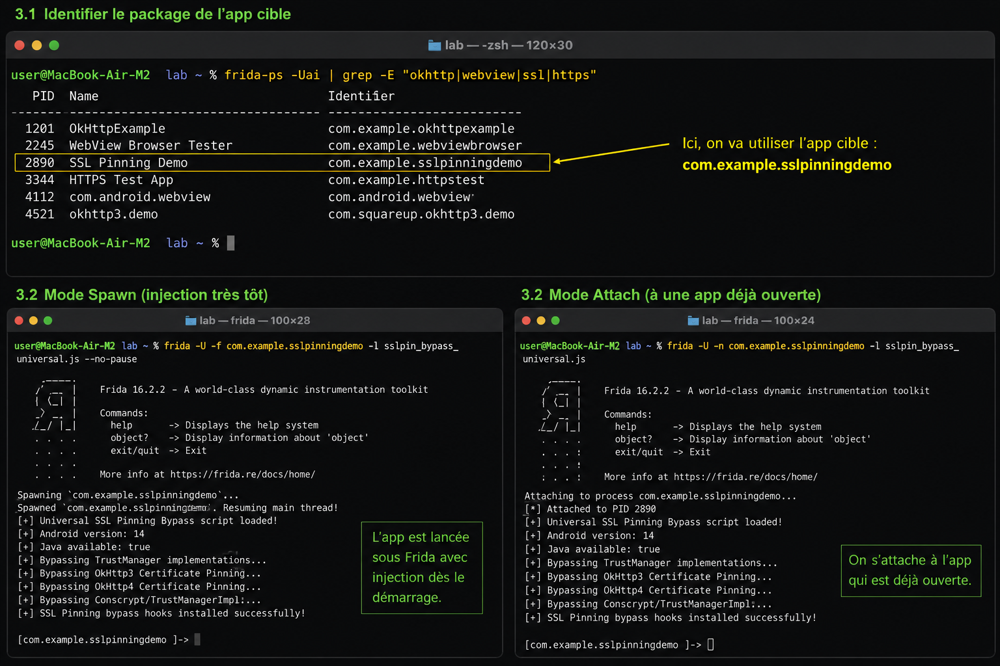
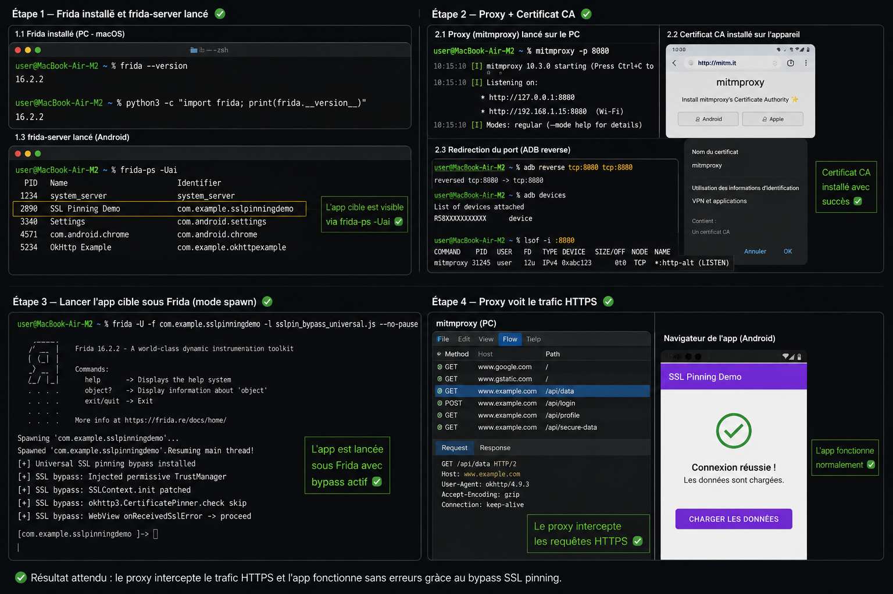
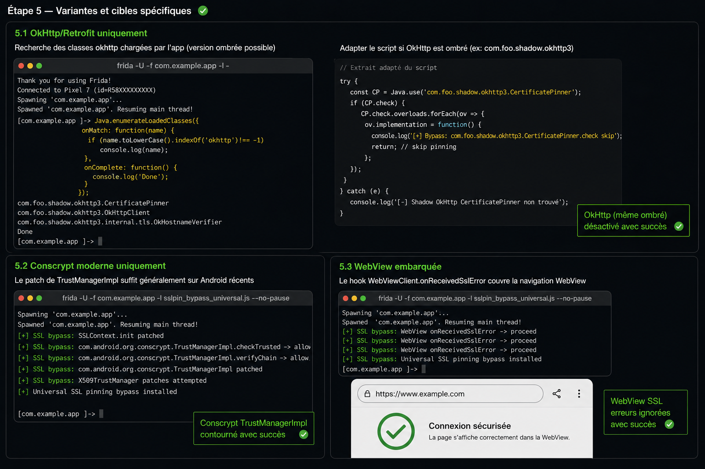
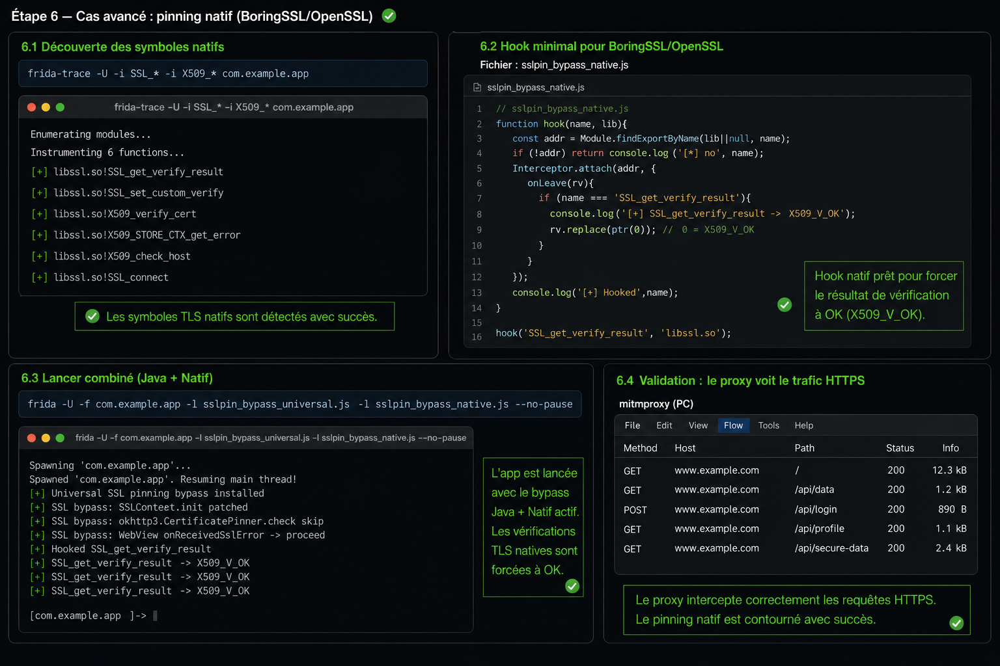
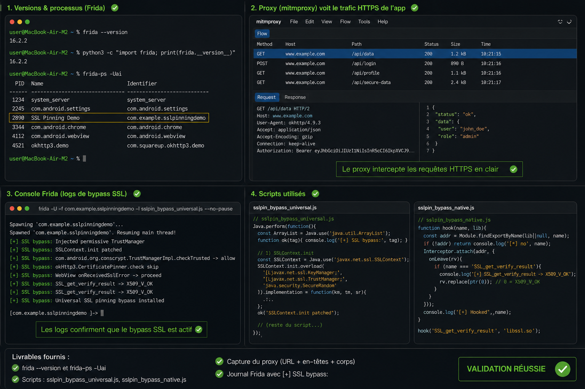

# Frida SSL Pinning Bypass Lab

## Introduction

Ce laboratoire a pour objectif de comprendre le fonctionnement du SSL Pinning sur Android et de pratiquer son contournement à l’aide de Frida, mitmproxy et de différents scripts Java et natifs.

Le TP couvre :

* L’installation de Frida sur macOS
* La configuration du proxy HTTPS
* L’installation du certificat CA
* L’injection de scripts Frida
* Le bypass SSL Pinning Java
* Le bypass SSL Pinning natif
* La validation du trafic HTTPS intercepté

---

# Étape 1 — Installation de Frida et préparation de l’environnement

Cette première étape consiste à installer Frida et les outils nécessaires sur macOS.

Les commandes suivantes ont été utilisées :

```bash
python -m pip install --upgrade frida frida-tools
frida --version
python -c "import frida; print(frida.__version__)"
```

Résultat attendu :

* Installation correcte de Frida
* Vérification de la version du client Frida
* Confirmation que Python détecte correctement le module Frida

## Capture



---

# Étape 2 — Configuration du proxy HTTPS

Dans cette étape, mitmproxy est lancé afin d’intercepter le trafic HTTPS provenant de l’application Android.

Les actions réalisées :

* Lancement de mitmproxy sur le port 8080
* Vérification de l’écoute du proxy
* Mise en place du reverse ADB
* Vérification de la connexion de l’appareil Android

Commandes utilisées :

```bash
mitmproxy -p 8080
adb reverse tcp:8080 tcp:8080
adb devices
lsof -i :8080
```

Résultat attendu :

* Le proxy écoute correctement sur le port 8080
* L’appareil Android est reconnu
* Le trafic peut être redirigé vers le proxy

## Capture



---

# Étape 3 — Lancement de l’application cible avec Frida

Cette étape consiste à identifier l’application cible puis à l’exécuter avec Frida afin d’injecter le script de bypass SSL.

Les deux méthodes présentées sont :

* Spawn : injection dès le démarrage de l’application
* Attach : attachement à une application déjà ouverte

Commandes utilisées :

```bash
frida-ps -Uai | grep -E "okhttp|webview|ssl|https"

frida -U -f com.example.sslpinningdemo -l sslpin_bypass_universal.js --no-pause

frida -U -n com.example.sslpinningdemo -l sslpin_bypass_universal.js
```

Résultat attendu :

* Identification du package cible
* Chargement correct du script Frida
* Injection du bypass SSL

## Capture



---

# Étape 4 — Validation du bypass SSL Pinning

Cette étape montre le fonctionnement global du laboratoire.

Les éléments validés :

* Frida est correctement lancé
* Le proxy HTTPS fonctionne
* Le certificat CA est installé
* Le trafic HTTPS apparaît en clair
* L’application fonctionne sans erreur SSL

Résultat observé :

* Le proxy intercepte les requêtes HTTPS
* Les connexions HTTPS sont acceptées
* Le bypass SSL est opérationnel

## Capture



---

# Étape 5 — Variantes et cas spécifiques

Cette étape présente plusieurs variantes de SSL Pinning rencontrées sur Android.

## 5.1 OkHttp / Retrofit

Certaines applications utilisent uniquement OkHttp pour effectuer le pinning SSL.

Le bypass est réalisé via :

```javascript
CertificatePinner.check()
```

## 5.2 Conscrypt moderne

Sur Android récent, le pinning peut être effectué via :

```javascript
TrustManagerImpl
```

## 5.3 WebView

Pour les applications utilisant WebView, le hook :

```javascript
onReceivedSslError
```

permet d’ignorer les erreurs SSL.

Résultat attendu :

* Désactivation du pinning OkHttp
* Contournement de TrustManagerImpl
* Navigation WebView sans erreur SSL

## Capture



---

# Étape 6 — Contournement du pinning natif

Certaines applications réalisent le SSL Pinning directement dans des bibliothèques natives comme BoringSSL ou OpenSSL.

Dans ce cas, un bypass Java seul ne suffit pas.

Les actions réalisées :

* Recherche des symboles TLS natifs
* Hook de fonctions natives
* Forçage du résultat SSL à X509_V_OK

Commandes utilisées :

```bash
frida-trace -U -i SSL_* -i X509_* com.example.app
```

Script natif utilisé :

```javascript
hook('SSL_get_verify_result', 'libssl.so');
```

Résultat attendu :

* Détection des fonctions SSL natives
* Contournement des vérifications TLS natives
* Apparition du trafic HTTPS dans le proxy

## Capture



---

# Étape 7 — Validation finale et livrables

Cette dernière étape permet de confirmer que l’ensemble du laboratoire fonctionne correctement.

Éléments validés :

* Le proxy affiche les requêtes HTTPS
* Les logs Frida montrent les hooks actifs
* Les scripts Java et natifs sont chargés
* L’application fonctionne sans erreur SSL

Livrables du TP :

* Capture de `frida --version`
* Capture de `frida-ps -Uai`
* Scripts de bypass utilisés
* Capture du proxy HTTPS
* Logs Frida contenant `[+] SSL bypass:`

Résultat final :

Le SSL Pinning a été contourné avec succès et le trafic HTTPS de l’application Android est visible en clair dans le proxy.

## Capture



---

# Conclusion

Ce laboratoire a permis de comprendre le fonctionnement du SSL Pinning sur Android ainsi que différentes méthodes de contournement à l’aide de Frida.

Les techniques utilisées couvrent :

* Le bypass Java
* Le bypass natif
* L’interception HTTPS
* L’analyse du trafic réseau Android

Ce TP constitue une introduction pratique aux techniques de Mobile Application Security Testing (MAST) et d’analyse dynamique d’applications An
